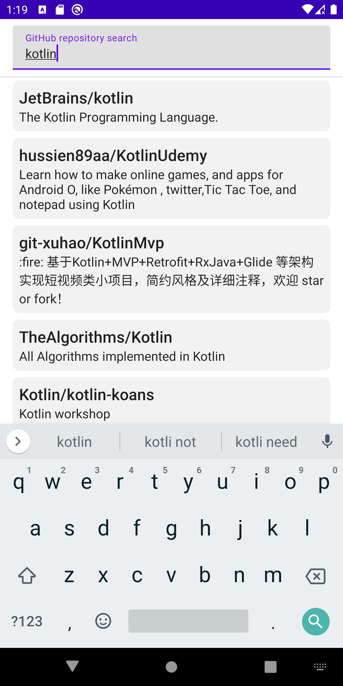

# GitHub Search demo application

Allows to search for a GitHub repository and open it in browser.

## Screenshots

 

## Stack

- Jetpack Compose
- MVVM
- Coroutines + Flow
- Paging
- Dagger 2
- Retrofit

## Modules

### [base/app](sources/base/app)

Contains Application, root Activity, dagger application component. Provides dependencies for features.

### [base/core](sources/base/core)

Contains domain models, interfaces that should be provided to features.

### [base/datasource](sources/base/datasource)

Contains data-providing logic: repositories implementations, paging sources, api generation.

### [base/designsystem](sources/base/designsystem)

Contains theme, color palette and common design elements.

### [base/navigation](sources/base/navigation)

Kotlin module. Contains keys and parameters for navigation graph.

### [features/search](sources/features/search)

Contains composed UI, ViewModel, dagger component for feature.

## Download

[Release APK](https://github.com/Yundin/GithHub_Search_Demo/releases/tag/1.0.0)

## Author

**Vladislav Yundin** /
4yundin@gmail.com /
[Resume](https://github.com/Yundin/resume/blob/master/resume_eng.pdf) /
[LinkedIn](https://www.linkedin.com/in/vladislav-yundin-74774b18a/)
